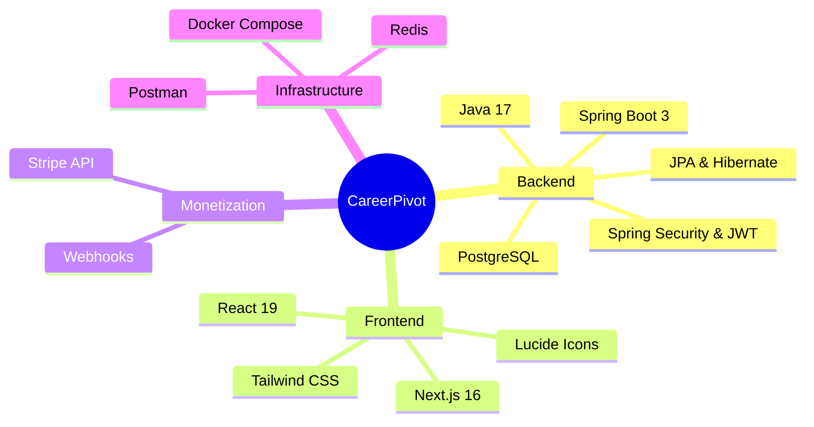

# CareerPivot MVP 🚀

Plateforme SaaS de stratégie de transition de carrière personnalisée, boostée par l'IA et l'expertise humaine.

## 🛠 Tech Stack




## ✨ Fonctionnalités (MVP + Phase 3)

1.  **Authentification**: Inscription et Connexion sécurisées (JWT).
2.  **Assessment**: Questionnaire de profilage stocké en JSONB.
3.  **IA Strategy**: Scénarios de transition (Pivot Adjacent vs Total) automatisés.
4.  **Roadmap Dynamique**: Plan d'action détaillé avec suivi des tâches.
5.  **Monétisation (Premium)**: Checkout Stripe et Feature Gating (Plans PRO/PREMIUM).
6.  **Accompagnement Expert**: Module de Coaching humain et retours sur Roadmap.
7.  **Backoffice Admin**: Métriques de performance et gestion des coachs.

## 🚀 Installation & Démarrage

### 1. Infrastructure
```bash
docker-compose up -d postgres redis
```

### 2. Backend
```bash
cd backend
mvn spring-boot:run
```
- API: `http://localhost:8080/api`
- Swagger UI: `http://localhost:8080/swagger-ui/index.html`

### 3. Frontend
```bash
cd frontend
npm install
npm run dev
```
- App: `http://localhost:3000`

## 🏗 Architecture
Le projet suit une architecture **Modulaire** permettant une séparation claire entre les modules `auth`, `billing`, `coaching`, et `roadmap`.

---
*Généré par Antigravity - Advanced Agentic Coding for CareerPivot.*
